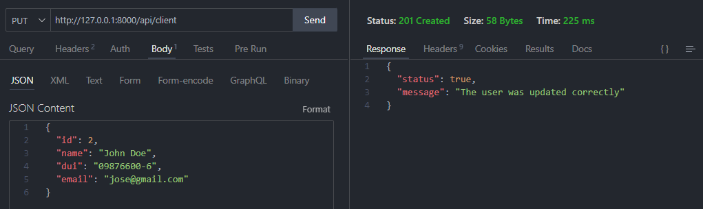

# Documentación del CRUD

### Consultas "GET"

-   La base de datos está vacía:

-   Base de datos con datos almacenados

### Consultas "POST"

-   Los datos son requeridos

-   El DUI necesita 10 caracteres

-   El usuario se ha insertado

-   No repita el número DUI al insertar

### Consultas "PUT"

-   El usuario a actualizar no existe

-   No repita el número DUI al actualizar

-   El usuario se ha actualizado

### Consultas "DELETE"

-   El usuario a eliminar no existe

-   El usuario se ha eliminado

